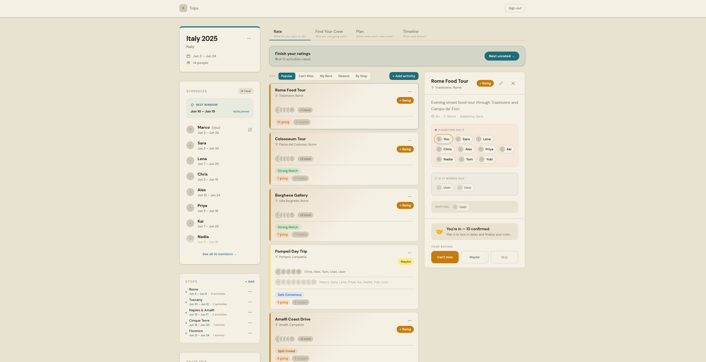
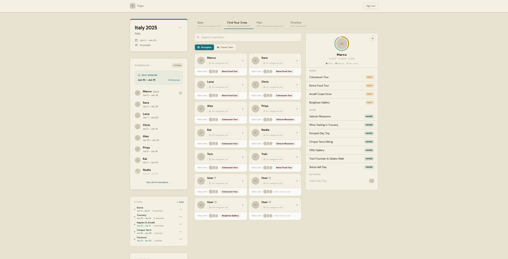
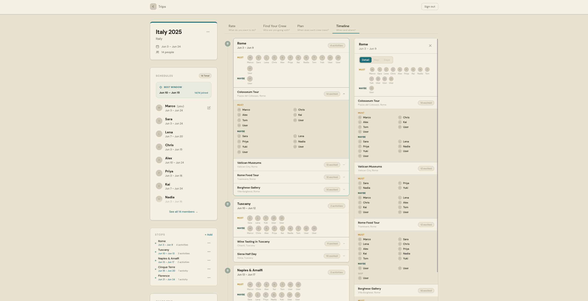
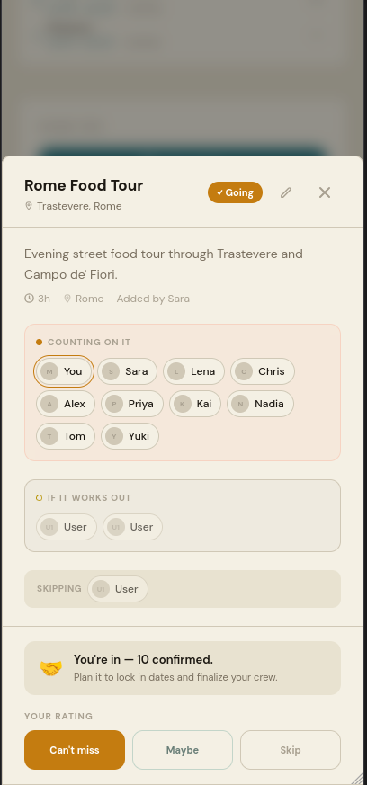
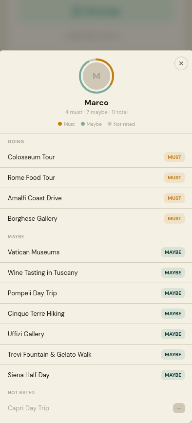
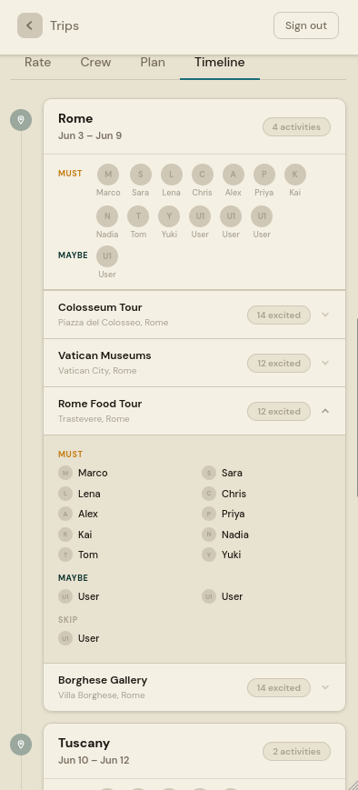

# Pulse

**Find your group's rhythm.**

[](https://github.com/ChrisPipitone/pulse-travel/actions/workflows/ci.yml)
[](https://nextjs.org)
[](LICENSE)

Group trip planning breaks on a bad assumption: that everyone does everything together. So the loudest voice picks, half the group tags along to things they didn't want, and the two people who *both* wanted the 6am hike never find each other.

Pulse is built around a different question — **who should do what together?** Everyone rates each activity MUST / MAYBE / SKIP, and the app surfaces the sub-groups hiding in those ratings: who's a crew for the food tour, who pairs on museums, which days converge enough to be worth planning around.

> **Status:** MVP. Core loop ships end to end; not yet deployed.

---

## Screenshots

|  |  |
| :-- | :-- |
| **Rate** — MUST / MAYBE / SKIP per activity, with live crew state on every card | **Find Your Crew** — sub-groups and pairwise compatibility, derived from the rating matrix |



**Timeline** — the itinerary by stop, showing the confirmed crew behind each activity.

<details>
<summary><b>Mobile</b></summary>

|  |  |  |
| :--: | :--: | :--: |
| Rate | Find Your Crew | Timeline |

</details>

---

## Architecture

The whole structure follows from one constraint: **the eventual Expo port must rewrite the UI layer and nothing else.** Every decision below falls out of that.

- **Zero business logic in components.** Fetching, scoring, and derivation live in `packages/hooks`; components render and nothing more. Hooks touch no platform APIs — no `window`, no `document`, no `localStorage`.
- **Dual-file UI primitives.** Each primitive in `packages/ui` ships as `Button.tsx` (HTML + Tailwind) and `Button.native.tsx` (RN + NativeWind) — same props, same class strings. Metro resolves `.native.tsx` automatically.
- **Services take a client, never read env.** Every function in `packages/services` accepts a `SupabaseClient` argument, so web (`NEXT_PUBLIC_*`) and mobile (`EXPO_PUBLIC_*`) each inject their own.
- **Hybrid logic placement.** UI filtering, sorting, and search stay client-side so they feel instant. Rating scores, the compatibility matrix, and anything auth- or permission-shaped run server-side, where there's one source of truth and the client isn't trusted.
- **RLS on every table.** Access control lives in Postgres policies, not in the client query.

Full detail: [`docs/reference/MVP_ARCHITECTURE.md`](docs/reference/MVP_ARCHITECTURE.md) · [`docs/reference/MONOREPO.md`](docs/reference/MONOREPO.md) · [`docs/reference/RATING_MATRIX.md`](docs/reference/RATING_MATRIX.md)

### Stack

| Layer           | Choice                             | Why                                                      |
| --------------- | ---------------------------------- | -------------------------------------------------------- |
| Frontend        | Next.js 16 + React 19 + TypeScript | App Router, strict mode                                   |
| Styling         | Tailwind CSS v4                    | CSS-first config, custom-property theming via next-themes |
| State           | Zustand 5                          | Behaves identically under React Native                    |
| Backend / DB    | Supabase (Postgres + Auth)         | RLS, email+password / OTP / Google OAuth                  |
| Monorepo        | Turborepo + pnpm workspaces        | Shared packages between web and a future Expo app         |
| Tests           | Vitest + Testing Library           | Unit-tested hook layer, run in CI                         |

### Repo layout

```
apps/
  web/                  # Next.js 16 — App Router

packages/
  types/                # @pulse/types     — shared TypeScript interfaces
  ui/                   # @pulse/ui        — primitives (.tsx + .native.tsx)
  store/                # @pulse/store     — Zustand stores
  services/             # @pulse/services  — Supabase query functions
  hooks/                # @pulse/hooks     — custom hooks + tests

supabase/
  migrations/           # SQL migrations, applied in filename-timestamp order
  schema.sql            # Schema reference (kept in sync with migrations)
  rls.sql               # RLS policy reference
  seed.sql              # Dev seed data — local only
```

---

## Quick start

**Prerequisites:** [pnpm](https://pnpm.io) v11+, [Docker Desktop](https://www.docker.com/products/docker-desktop/) (for local Supabase), [Supabase CLI](https://supabase.com/docs/guides/cli).

```bash
pnpm install

cp apps/web/.env.local.example apps/web/.env.local
# Fill NEXT_PUBLIC_SUPABASE_URL + NEXT_PUBLIC_SUPABASE_ANON_KEY from `make up` output

# Google OAuth for local Supabase — supabase/.env is gitignored
echo "SUPABASE_AUTH_GOOGLE_CLIENT_ID=your-client-id" >> supabase/.env
echo "SUPABASE_AUTH_GOOGLE_SECRET=your-client-secret" >> supabase/.env

make up        # start local Supabase (Docker) — prints Project URL + anon key
make reseed    # load schema + seed data
make dev       # http://localhost:3000
```

Sign in with any seed user below, password `password123`.

### Tests

```bash
pnpm --filter @pulse/hooks test             # unit tests (Vitest + happy-dom)
pnpm --filter @pulse/hooks test:watch
pnpm --filter pulse-web exec tsc --noEmit   # type check
```

---

<details>
<summary><b>Make targets</b></summary>

#### Local Supabase

| Command       | When to use                                                                       |
| ------------- | --------------------------------------------------------------------------------- |
| `make up`     | Start local Supabase (Docker). Once per session, or after `make down`.            |
| `make down`   | Stop local Supabase. Safe anytime — the Docker volume persists, no data lost.     |
| `make status` | Print local Supabase URLs and anon key, if you lost the `make up` output.         |

#### Database — reset and seed

| Command       | When to use                                                                                                      |
| ------------- | ---------------------------------------------------------------------------------------------------------------- |
| `make reseed` | **Full reset.** Drops the DB, replays all migrations, runs `seed.sql`. Destroys local data.                      |
| `make reset`  | Alias for `make reseed`.                                                                                          |
| `make seed`   | Re-run `seed.sql` against the running DB without touching the schema. Truncates data rows first.                 |
| `make clear`  | Wipe all data rows, keep the schema and `activity_categories`. For manual testing from a clean slate.            |

#### Migrations

Migrations live in `supabase/migrations/` and apply in filename order. The prefix is a timestamp — never rename or reorder them.

| Command                      | When to use                                                                               |
| ---------------------------- | ------------------------------------------------------------------------------------------ |
| `make migration name=<name>` | Create a new timestamped migration. Always use this, never hand-create the file.          |
| `make migrate`               | Apply pending migrations to the running local DB **without** resetting data.              |
| `make push`                  | Push migrations to the **hosted** Supabase project. Requires `make link` first.           |
| `make link ref=<project-ref>`| Link the CLI to a hosted project. Ref is in the Supabase dashboard URL.                   |
| `make types`                 | Regenerate TS types from the local schema into `packages/types/src/supabase.gen.ts`.      |

```bash
make migration name=add_budget_to_trips
# write the SQL
make migrate    # apply locally, keep data
make push       # when ready for production
```

If PostgREST reports `Database error querying schema` after `make migrate`, run `supabase stop && supabase start` — PostgREST caches the schema at startup.

Never run `make seed` against production.

</details>

<details>
<summary><b>Auth and seed data</b></summary>

Three sign-in methods on `/login`: email + password, OTP code, Google OAuth.

Seed users — all password `password123`:

| Email | Name | | Email | Name |
| ----- | ---- |-| ----- | ---- |
| `marco@example.com` | Marco | | `alex@example.com`  | Alex  |
| `sara@example.com`  | Sara  | | `priya@example.com` | Priya |
| `lena@example.com`  | Lena  | | `kai@example.com`   | Kai   |
| `chris@example.com` | Chris | | `yuki@example.com`  | Yuki  |

OTP emails are intercepted locally by Mailpit at `http://127.0.0.1:54324`.

#### Environment files

| File                  | Purpose                                     | Committed |
| --------------------- | ------------------------------------------- | --------- |
| `apps/web/.env.local` | Local Supabase URL + anon key               | No        |
| `apps/web/.env.prod`  | Hosted Supabase URL + anon key              | No        |
| `supabase/.env`       | Google OAuth credentials for local Supabase | No        |

</details>

---

## Docs

Documentation is tiered by folder — trust is encoded in the path. Start at [`docs/INDEX.md`](docs/INDEX.md).

| Folder               | Trust                                                  |
| -------------------- | ------------------------------------------------------ |
| `docs/canonical/`    | Source of truth — product model, branding, UX spec     |
| `docs/reference/`    | How a subsystem works today                            |
| `docs/decisions/`    | Dated ADRs — why a choice was made                     |

Key entry points: [`PRODUCT.md`](docs/canonical/PRODUCT.md) for the rating vocabulary and crew model, [`RATING_MATRIX.md`](docs/reference/RATING_MATRIX.md) for the scoring formula, [`CLAUDE.md`](CLAUDE.md) for architecture rules and code standards.

---

## License

[GNU AGPL-3.0](LICENSE) — Copyright © 2026 Chris Pipitone.

You may use, modify, and self-host this code; if you run a modified version as a network service, you must publish your source under the same license.
