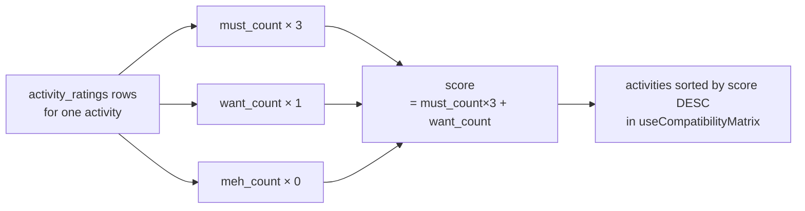
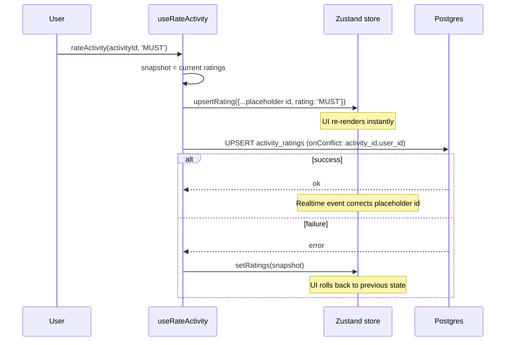

# Rating & Compatibility Matrix

---

## Rating System

Three values, each with a deliberate meaning:

| Rating | Weight | Meaning |
|---|---|---|
| `MUST` | 3 | Non-negotiable — I will be disappointed if we skip this |
| `WANT` | 1 | Would love to do it — happy if it fits |
| `MEH` | 0 | Indifferent — won't affect my enjoyment either way |

MEH contributes zero to the score intentionally — it's a deliberate non-vote, not weak support. Three people MUSTing beats ten people WANTing (3×3=9 vs 10×1=10, barely — but one more MUST tips it decisively).

---

## Scoring



**Formula:** `score = (MUST count × 3) + (WANT count × 1)`

Example — 8-member trip, activity "Colosseum Tour":

| Member | Rating |
|---|---|
| Marco | MUST |
| Sara | MUST |
| Lena | WANT |
| Chris | WANT |
| Alex | MEH |
| Priya | MUST |
| Kai | WANT |
| Yuki | — |

`score = 3×3 + 3×1 = 12`. Sorted above any activity with score < 12.

---

## Data Flow


---

## Optimistic Rating Update

User taps MUST/WANT/MEH → UI responds immediately, network follows:



The placeholder `id` (`crypto.randomUUID()`) is overwritten when the real-time channel re-fetches ratings after the DB write — no stale id persists.

---

## CompatibilityScore Type

```ts
interface CompatibilityScore {
  activity_id: string
  score: number          // must×3 + want×1
  must_count: number
  want_count: number
  meh_count: number
  ratings: Record<string, Rating>  // keyed by user_id — O(1) lookup in matrix UI
}
```

`useCompatibilityMatrix` returns `CompatibilityScore[]` sorted by `score` descending. The `ratings` map lets the matrix UI look up any member's rating for any activity in O(1) — no `.find()` per cell.

---

## Compatibility Matrix UI (planned)

The matrix is a grid of `activities × members`, each cell coloured by that member's rating for that activity.

```
                Marco   Sara    Lena    Chris   Alex
Colosseum       MUST    MUST    WANT    WANT    MEH      score: 12
Wine Tasting    MUST    WANT    MUST    MEH     WANT     score: 10
Vatican         WANT    MUST    MEH     WANT    MUST     score: 10
Amalfi Day      MEH     WANT    WANT    —       WANT     score:  3
```

Cell colours:

| Rating | Background | Text |
|---|---|---|
| MUST | `--must-bg` (coral) | `--must-text` |
| WANT | `--want-bg` (mint) | `--want-text` |
| MEH | `--meh-bg` (yellow) | `--meh-text` |
| — (unrated) | `--cell-empty` | — |

Planned views:
- **Matrix** — full grid, all members × all activities
- **Cluster** — group activities by "who should do this together" (members with MUST/WANT in common)
- **Conflict** — highlight activities where members strongly diverge (some MUST, some MEH)

---

## Real-time Sync

`useTripData` subscribes to two Postgres change channels on mount:

```
channel: trip-<tripId>
  ├── activities table, filter: trip_id=eq.<tripId>
  │   → on any change: refetch activities → setActivities
  └── activity_ratings table (no trip_id column — unfiltered)
      → on any change: refetch activities, then ratings for those activity IDs
```

`activity_ratings` has no `trip_id` column, so it can't be filtered server-side by trip. The channel fires on any rating change in the session. The re-fetch is scoped by activity IDs which already belong to the trip — RLS further ensures only permitted rows are returned.

Channel cleanup on unmount: `client.removeChannel(channel)` — prevents duplicate events on re-mount.
