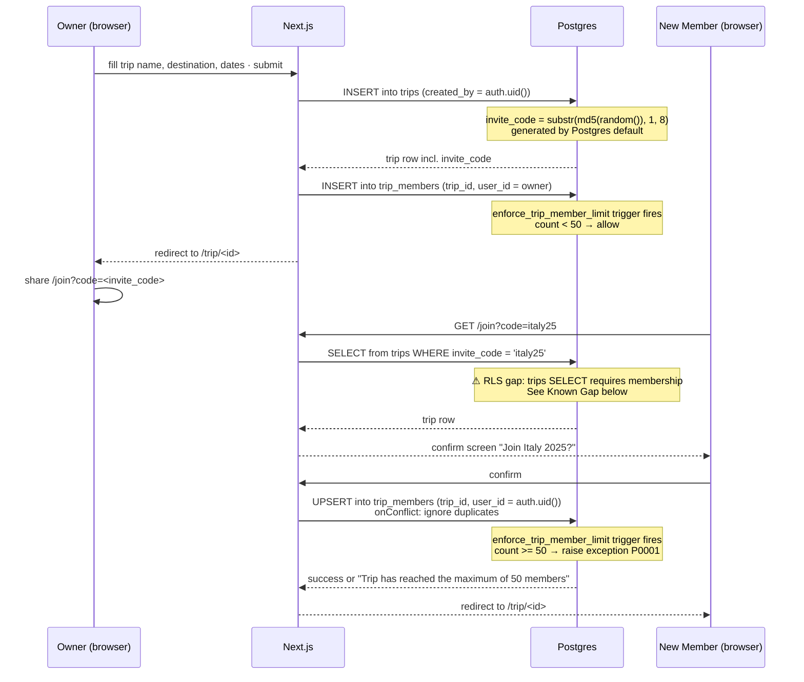
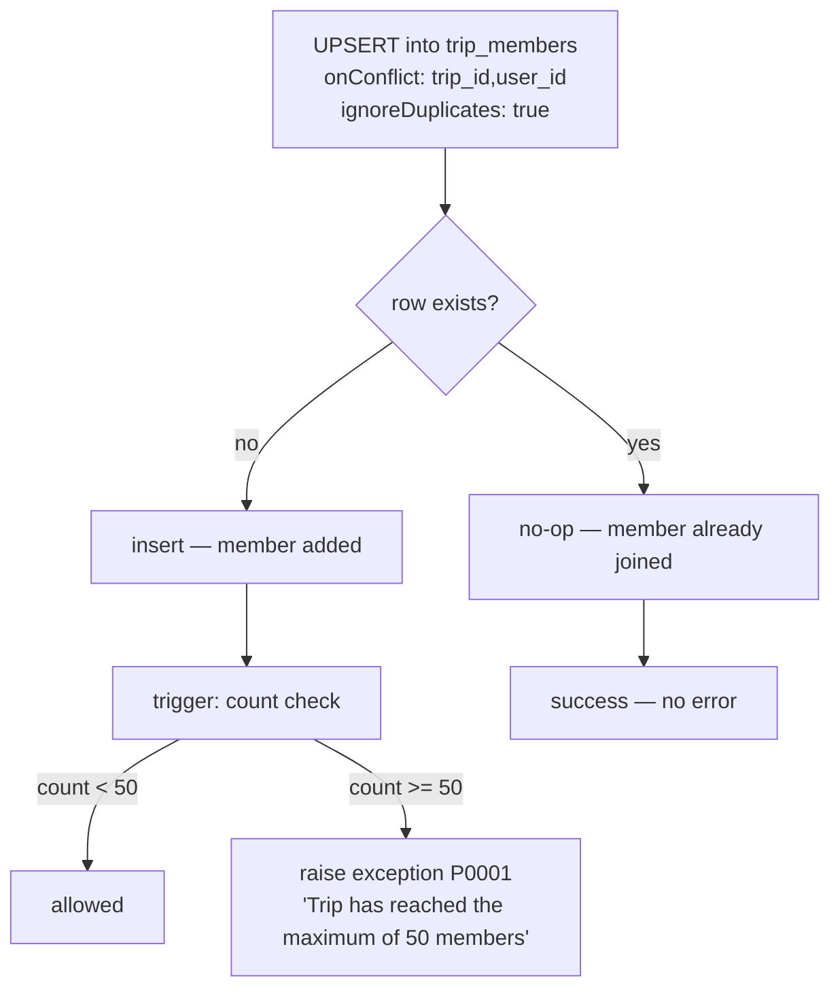
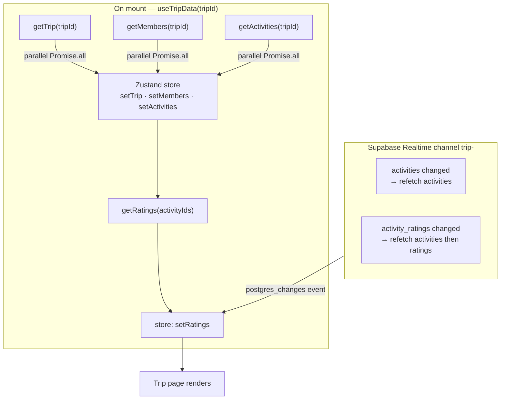
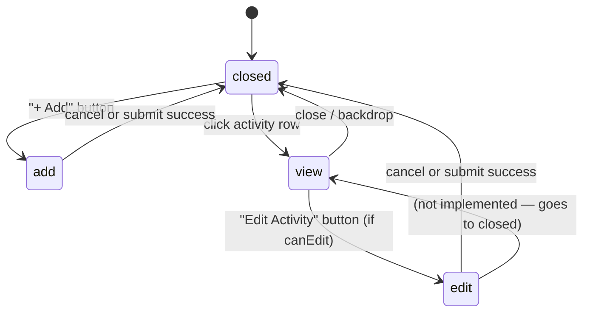

# Trip Flow

Covers: trip creation, invite link lifecycle, join flow, and the UI state machine on the trip page.

---

## Create → Invite → Join



---

## Invite Code

| Property | Value |
|---|---|
| Format | 8-char hex string (`substr(md5(random()), 1, 8)`) |
| Uniqueness | Enforced by `UNIQUE` constraint on `trips.invite_code` |
| Collision | Extremely unlikely at scale; no retry logic currently |
| Expiry | None — permanent until trip is deleted |
| Revoke | Not implemented — delete and recreate trip to invalidate |

Invite URL shape: `https://app.domain/join?code=<invite_code>`

---

## Duplicate Join

Re-clicking an invite link after already being a member is handled safely:



---

## Member Limit Enforcement

The 50-member cap is enforced at the database level via a `BEFORE INSERT` trigger — applies to all inserts regardless of path (RLS, service role, direct SQL).

```
migrations/20260520000002_trip_member_limit.sql
  └── function: public.check_trip_member_limit() SECURITY DEFINER
  └── trigger:  enforce_trip_member_limit BEFORE INSERT ON trip_members FOR EACH ROW
```

The trigger counts existing rows for the trip before the new insert. The service layer (`joinTrip` in `packages/services/src/trips.ts`) catches error message `'maximum of 50 members'` and re-throws a user-friendly message.

Cap is arbitrary — revisit before launch. See `memory/project_group_size_limit.md`.

---

## Trip Page Data Flow



Trip, members, and activities are fetched in parallel. Ratings follow because they require activity IDs. Realtime keeps all connected members' views in sync without polling.

---

## Trip Page Modal State Machine



`ModalState` is a discriminated union in `apps/web/src/app/trip/[id]/page.tsx`:

```ts
type ModalState =
  | { mode: 'closed' }
  | { mode: 'add' }
  | { mode: 'view'; activity: Activity }
  | { mode: 'edit'; activity: Activity }
```

TypeScript narrows `modal.activity` automatically in each branch — no `activity?` nullable needed.

---

## Permission Model

| Action | Who can |
|---|---|
| View trip | Any member |
| Add activity | Any member |
| Edit activity | Adder of that activity OR trip owner |
| Delete activity | Adder of that activity OR trip owner |
| Rate activity | Any member (own rating only) |
| Add/delete trip events | Trip owner only |
| Remove a member | Member themselves OR trip owner |

`canEdit(activity)` in the trip page: `isOwner || activity.added_by === userId`. Enforced in both UI (hides edit/delete buttons) and RLS (`activities: update if adder or owner` policy).

---

## Invite Code Lookup — RLS Solution

`trips` SELECT RLS requires `is_trip_member(id)` — a non-member cannot query the table directly. Pure RLS cannot express "allow if the queried invite_code matches" because policy expressions have no access to query parameters.

**Fix (applied in `20260520000003_invite_code_lookup.sql`):** `SECURITY DEFINER` function `public.get_trip_by_invite_code(p_code text)` — same pattern as `is_trip_member`. Only returns the row matching the exact code; no other trips exposed. Callable by `authenticated` role only; revoked from `public`.

`getTripByInviteCode` in `packages/services/src/trips.ts` now calls `client.rpc('get_trip_by_invite_code', { p_code: code })` instead of a direct table query.
