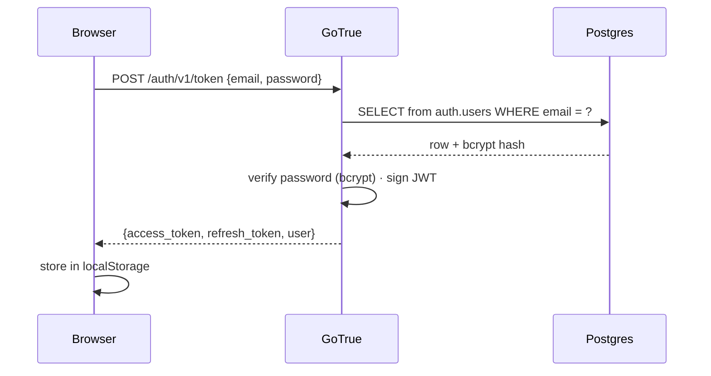
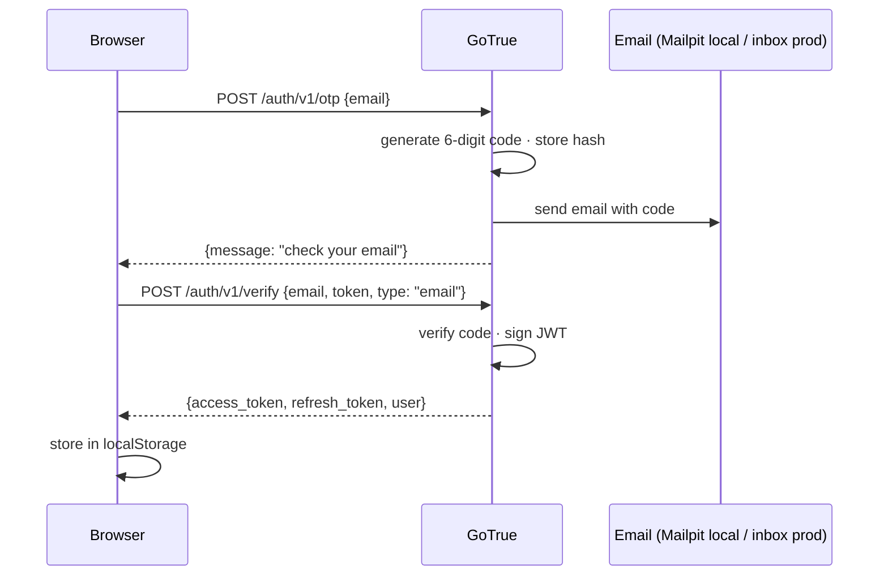
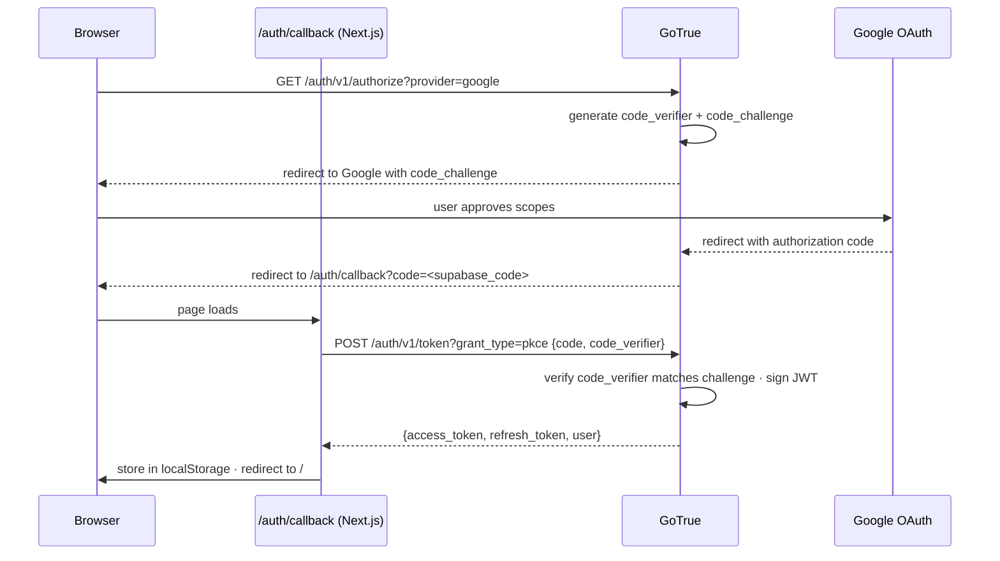
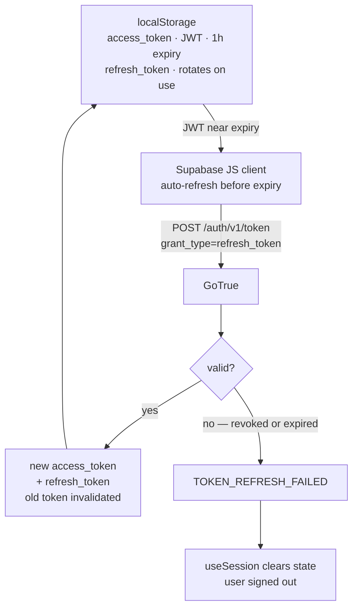
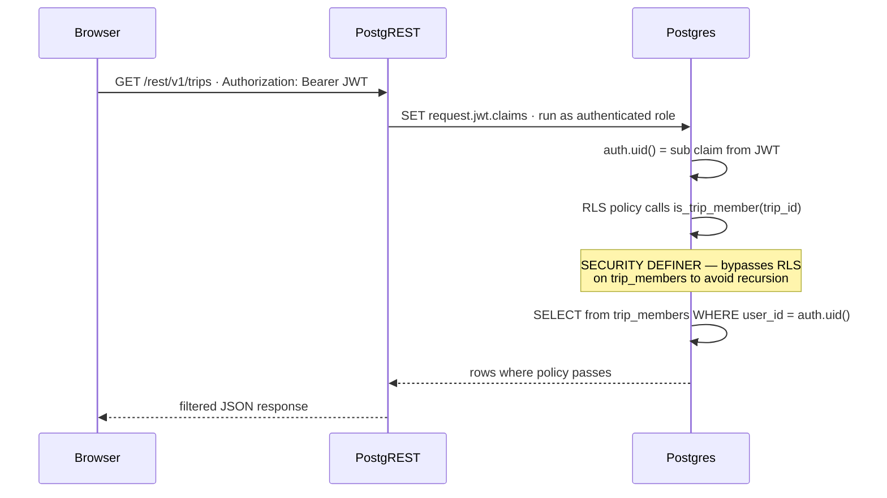
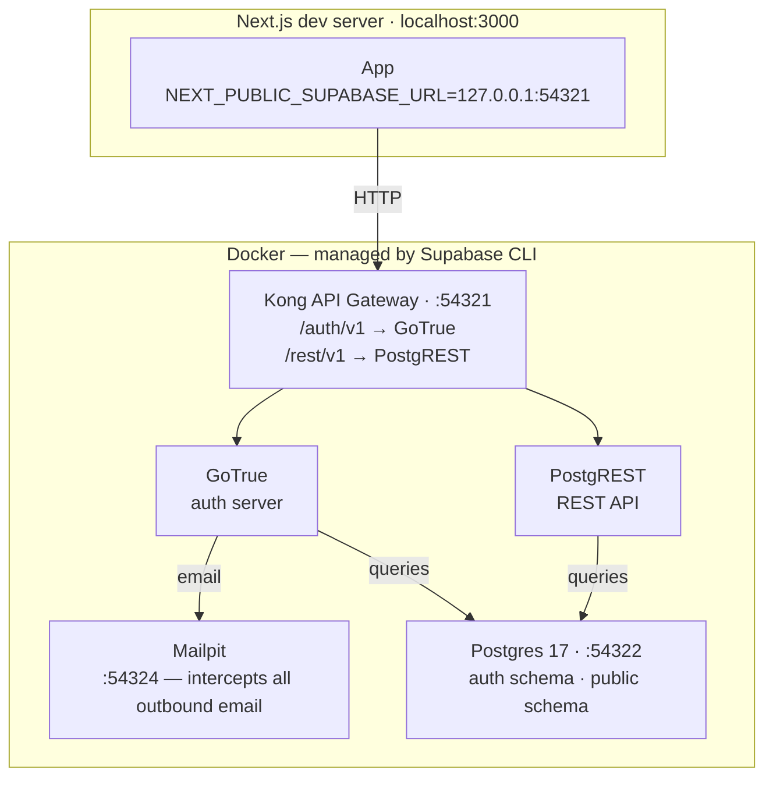
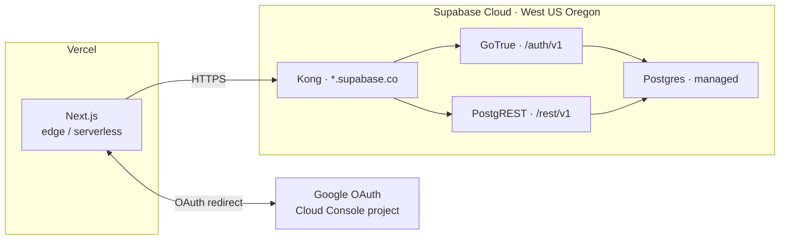

# Authentication

Pulse uses [Supabase Auth (GoTrue)](https://supabase.com/docs/guides/auth) for all authentication. Three sign-in methods are supported. After sign-in, all data access is enforced by Postgres RLS — the auth server is not involved in subsequent requests.

---

## Stack

| Component          | Role                                                                               |
| ------------------ | ---------------------------------------------------------------------------------- |
| GoTrue             | Auth server — issues JWTs, manages sessions, sends OTP emails, handles OAuth       |
| Supabase JS client | Browser-side — calls GoTrue, stores session in `localStorage`, auto-refreshes JWTs |
| `auth.users`       | GoTrue-managed table — stores encrypted passwords, tokens, provider metadata       |
| `auth.identities`  | One row per provider per user — used to look up user by email + provider           |
| `public.profiles`  | App-managed table — display name, avatar; joined to `auth.users` via matching `id` |
| Postgres RLS       | Row-level security — enforces data access using `auth.uid()` from the JWT          |

---

## Sign-in Methods

### 1 — Email + Password

**Key points:**

- Password hashed with bcrypt (`pgcrypto.crypt`) — stored in `auth.users.encrypted_password`
- `auth.identities` must have a row with `provider = 'email'` — GoTrue looks up user by provider, not just email column
- GoTrue scans `email_change` as a non-nullable string — seed data must include `email_change = ''` and `email_change_token_new = ''` or login returns 500

---

### 2 — OTP (email code)

**Key points:**

- Passwordless — user only needs email access
- Local dev: GoTrue intercepts all outbound email → Mailpit at `http://127.0.0.1:54324`
- OTP type is `'email'` (not `'magiclink'`) — returns a 6-digit code, not a clickable link
- Rate limit: `max_frequency = "1s"` in `supabase/config.toml` — increase to `"60s"` before prod

---

### 3 — Google OAuth (PKCE)

**PKCE explained:** The browser generates a random `code_verifier` and sends only its SHA-256 hash (`code_challenge`) to Google. The auth code in the redirect URL is useless without the original verifier — an intercepted URL cannot be exchanged. The verifier is held in memory and sent only in the final token request.

**Local dev difference:** Local Supabase returns tokens in the URL hash (`#access_token=...`) — the implicit flow. The callback page detects which path: `?code=` present → PKCE exchange; absent → listen for `onAuthStateChange('SIGNED_IN')`.

---

## Session Management

| Setting                         | Value      | Effect                                                                       |
| ------------------------------- | ---------- | ---------------------------------------------------------------------------- |
| `jwt_expiry`                    | 3600s (1h) | Access token lifetime                                                        |
| `enable_refresh_token_rotation` | true       | Old refresh token invalidated on each use                                    |
| `refresh_token_reuse_interval`  | 10s        | Grace window — prevents false invalidation when two requests race to refresh |

---

## How RLS Consumes the JWT

Every Postgres query from an authenticated client carries the JWT in the `Authorization` header. PostgREST extracts `auth.uid()` from the token and sets it as a session variable — no network call to GoTrue per query.

`is_trip_member(uuid)` runs as the function owner (`postgres` role), not the caller. Without this, `trips` SELECT policy would query `trip_members`, which would trigger `trip_members` SELECT policy, which would query `trips` — infinite recursion.

---

## Infrastructure

### Local Dev

### Production

---

## Pre-Production Checklist

| Item                   | Location                                      | Action                                                        |
| ---------------------- | --------------------------------------------- | ------------------------------------------------------------- |
| Email confirmation     | `supabase/config.toml [auth.email]`           | `enable_confirmations = true`                                 |
| OTP rate limit         | `supabase/config.toml [auth.email]`           | `max_frequency = "60s"`                                       |
| Profile creation       | New migration                                 | Trigger on `auth.users` INSERT → insert `public.profiles` row |
| Session storage        | `apps/web/src/lib/supabase.ts`                | `@supabase/ssr` + httpOnly cookies if XSS hardening needed    |
| Google redirect URIs   | Google Cloud Console                          | Add production domain                                         |
| Supabase redirect URLs | Hosted Supabase dashboard → Auth → URL config | Add production domain                                         |
