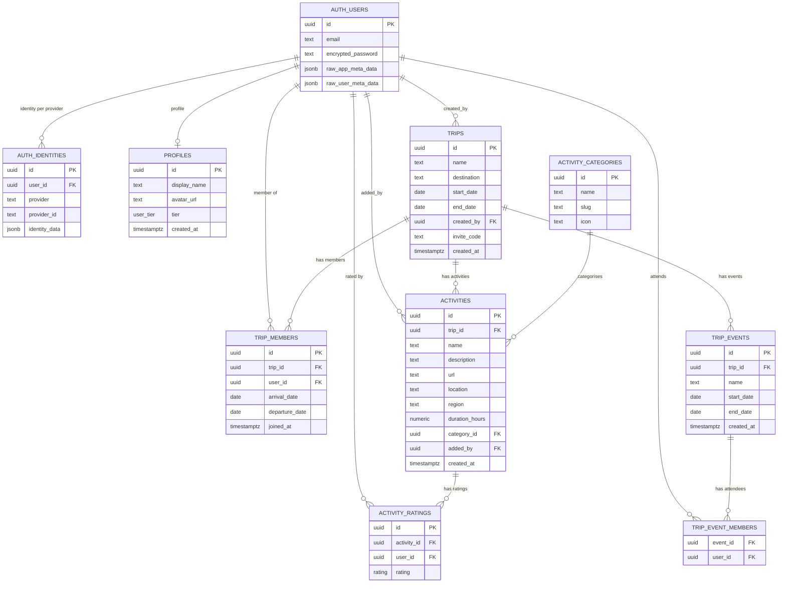

# Data Model

---

## Entity Relationship Diagram

---

## Schema Notes

### auth schema (GoTrue-managed — do not migrate directly)

| Table | Purpose |
|---|---|
| `auth.users` | One row per user. Source of truth for identity. `id` is the UUID used everywhere else. |
| `auth.identities` | One row per provider per user. Required for `signInWithPassword` — GoTrue looks up user via `provider_id + provider`, not just `email`. |

### public schema (app-managed — always use migrations)

| Table | Key constraints |
|---|---|
| `profiles` | PK = `auth.users.id` — 1:1. Stores display name and avatar. No trigger yet: profile row must be created explicitly after sign-up. |
| `trips` | `invite_code` unique, default `substr(md5(random()), 1, 8)` — 8-char hex. |
| `trip_members` | Unique on `(trip_id, user_id)` — duplicate join is a no-op via upsert. Cap enforced by `enforce_trip_member_limit` trigger; the limit comes from the trip owner's tier. |
| `activities` | Soft FK: no FK from `trip_members` to `profiles` — member profiles are fetched in a separate query joined in application code. |
| `activity_ratings` | Unique on `(activity_id, user_id)` — one rating per person per activity. Upserted on change. `rating` is a Postgres enum: `MUST \| MAYBE \| SKIP`. |
| `activity_categories` | Static reference data. Seeded in `init_schema` migration. Not user-editable. 8 categories. |
| `trip_events` | Named blocks of time (e.g. "Rossi Wedding June 10–12"). Used to mark days as blocked for certain members. |
| `trip_event_members` | Junction table — which members are blocked by which event. Composite PK `(event_id, user_id)`. |

---

## RLS Policy Map

RLS is enabled on all tables. `anon` role is fully revoked. All policies require the `authenticated` role.

```mermaid
flowchart TD
    A["Authenticated request\nJWT → auth.uid()"]

    A --> P["profiles"]
    P --> P1["SELECT: any authenticated user"]
    P --> P2["INSERT: own row only (id = auth.uid())"]
    P --> P3["UPDATE: own row only"]

    A --> T["trips"]
    T --> T1["SELECT: is_trip_member(id) ✦"]
    T --> T2["INSERT: created_by = auth.uid()"]
    T --> T3["UPDATE / DELETE: owner only"]

    A --> TM["trip_members"]
    TM --> TM1["SELECT: same trip as auth.uid()"]
    TM --> TM2["INSERT: user_id = auth.uid()"]
    TM --> TM3["UPDATE: own row (dates only)"]
    TM --> TM4["DELETE: self OR trip owner"]

    A --> AC["activities"]
    AC --> AC1["SELECT: trip member"]
    AC --> AC2["INSERT: trip member + added_by = auth.uid()"]
    AC --> AC3["UPDATE: adder OR trip owner"]
    AC --> AC4["DELETE: adder OR trip owner"]

    A --> AR["activity_ratings"]
    AR --> AR1["SELECT: trip member"]
    AR --> AR2["INSERT / UPDATE / DELETE: own rating only"]

    A --> ACA["activity_categories"]
    ACA --> ACA1["SELECT: all (public reference data)"]

    A --> TE["trip_events"]
    TE --> TE1["SELECT: trip member"]
    TE --> TE2["INSERT / UPDATE / DELETE: trip owner only"]

    A --> TEM["trip_event_members"]
    TEM --> TEM1["SELECT: trip member"]
    TEM --> TEM2["INSERT / DELETE: trip owner only"]
```

**✦ Recursion break:** `trips` SELECT calls `is_trip_member(uuid)`, a `SECURITY DEFINER` function that queries `trip_members` bypassing RLS. Without this, `trips` policy → `trip_members` RLS → `trips` policy → infinite recursion. See `migrations/20260520000000_fix_rls_recursion.sql`.

---

## Indexes

| Table | Index columns | Reason |
|---|---|---|
| `trip_members` | `trip_id` | Filter members by trip |
| `trip_members` | `user_id` | Filter trips by user |
| `activities` | `trip_id` | Filter activities by trip |
| `activity_ratings` | `activity_id` | Join ratings to activities |
| `activity_ratings` | `user_id` | Filter ratings by user |
| `trip_events` | `trip_id` | Filter events by trip |

---

## Known Gaps

| Gap | Impact | Fix |
|---|---|---|
| No profile creation trigger | User can be authenticated but have no `profiles` row — display name shows as "Unknown" | Add `AFTER INSERT ON auth.users` trigger to insert `profiles` row |
| `trips` SELECT requires membership | ~~`getTripByInviteCode` fails for non-members~~ — **fixed** via `get_trip_by_invite_code` SECURITY DEFINER function (`20260520000003_invite_code_lookup.sql`) | — |
| No FK: `trip_members.user_id` → `profiles.id` | Member profile data fetched in two queries joined in application code | Add FK or use Supabase embedded select once profiles FK is confirmed stable |
