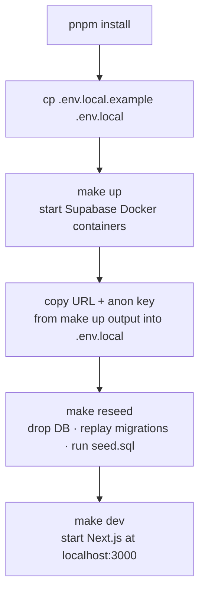
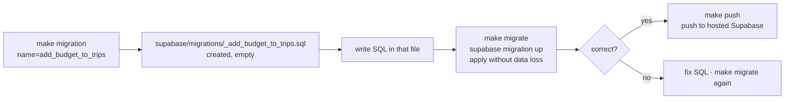
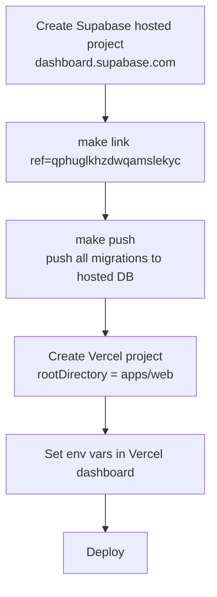

# Deployment

---

## Environments

| Environment | Frontend | Backend | DB |
|---|---|---|---|
| Local dev | Next.js `:3000` | Supabase CLI (Docker) `:54321` | Postgres 17 `:54322` |
| Production | Vercel (hobby) | Supabase Cloud — West US Oregon | Postgres (managed) |

Project ref: `qphuglkhzdwqamslekyc`  
Supabase project name: `activity-matrix`

---

## Environment Files

| File | Environment | Committed? | Contains |
|---|---|---|---|
| `apps/web/.env.local` | Local dev | No | `NEXT_PUBLIC_SUPABASE_URL`, `NEXT_PUBLIC_SUPABASE_ANON_KEY` pointing to `127.0.0.1:54321` |
| `apps/web/.env.prod` | Production | No | Same vars pointing to `*.supabase.co` |
| `supabase/.env` | Local Supabase CLI | No | `SUPABASE_AUTH_GOOGLE_CLIENT_ID`, `SUPABASE_AUTH_GOOGLE_SECRET` |

`apps/web/.env.local.example` is committed and shows the required keys with empty values.

---

## Local Dev Setup



Values from `make up` (or `make status` if already running):

```
API URL:   http://127.0.0.1:54321
anon key:  eyJ...
```

Paste both into `apps/web/.env.local`.

---

## Migrations

Migrations live in `supabase/migrations/` and are applied in filename timestamp order. Never rename or reorder them.



**`make reseed` vs `make migrate`:**

| Command | What it does | When to use |
|---|---|---|
| `make migrate` | Apply pending migrations to running DB — no data loss | New migration file, want to keep existing rows |
| `make reseed` | Drop DB + replay all migrations + run seed.sql | Clean known state, after pulling someone else's migrations |

**After `make migrate` if PostgREST returns "Database error querying schema":**
```bash
supabase stop && supabase start
```
PostgREST caches schema at startup — restart forces reload.

---

## Production Deployment

### First-time setup



### Vercel project settings

| Setting | Value |
|---|---|
| Root directory | `apps/web` |
| Framework preset | Next.js |
| Build command | `pnpm build` (auto-detected) |
| Install command | `pnpm install` |

### Vercel environment variables

Set these in Vercel dashboard → Project → Settings → Environment Variables:

| Variable | Value | Environment |
|---|---|---|
| `NEXT_PUBLIC_SUPABASE_URL` | `https://qphuglkhzdwqamslekyc.supabase.co` | Production |
| `NEXT_PUBLIC_SUPABASE_ANON_KEY` | from Supabase dashboard → Settings → API | Production |

### Supabase hosted config (dashboard)

| Section | Setting | Value |
|---|---|---|
| Auth → URL Configuration → Site URL | Site URL | `https://<your-vercel-domain>.vercel.app` |
| Auth → URL Configuration | Redirect URLs | `https://<your-vercel-domain>.vercel.app/auth/callback` |
| Auth → Providers → Google | Client ID / Secret | from Google Cloud Console |

### Google Cloud Console

Add to the OAuth 2.0 credentials for the project:

| Field | Value |
|---|---|
| Authorized JavaScript origins | `https://<your-vercel-domain>.vercel.app` |
| Authorized redirect URIs | `https://qphuglkhzdwqamslekyc.supabase.co/auth/v1/callback` |

---

## Ongoing Deployments

Schema changes → always write a migration first:

```bash
make migration name=<descriptive_name>
# write SQL
make migrate          # test locally
make push             # apply to production
```

Code changes → push to main branch → Vercel auto-deploys.

Never run `make seed` against production. Seed data is local-only.

---

## Supabase Free Tier Limits

| Limit | Value | Risk |
|---|---|---|
| DB storage | 500 MB | Low for MVP |
| Bandwidth | 5 GB/month | Low for MVP |
| MAU | 50,000 | Low for MVP |
| Projects | 2 | Current: 1 |
| **Inactivity pause** | **7 days** | **Resume manually from dashboard if paused** |

If upgrading to Pro: enable **Spend Cap** immediately in billing settings.

---

## Pre-Production Checklist

| Item | Status | Action |
|---|---|---|
| Email confirmation | Not done | `supabase/config.toml`: `enable_confirmations = true` → `make push` |
| OTP rate limit | Not done | `supabase/config.toml`: `max_frequency = "60s"` → `make push` |
| Profile creation trigger | Not done | New migration: `AFTER INSERT ON auth.users` → insert `public.profiles` |
| Google OAuth redirect URIs | Not done | Add prod domain to Google Cloud Console |
| Supabase redirect URLs | Not done | Add prod domain to Supabase Auth → URL Configuration |
| Vercel env vars | Not done | Set `NEXT_PUBLIC_SUPABASE_URL` + `NEXT_PUBLIC_SUPABASE_ANON_KEY` |
| Deploy | Not done | Create Vercel project, set `rootDirectory = apps/web` |
| Verify hosted migrations | Not done | `make push` — confirm all 6 migrations applied |
